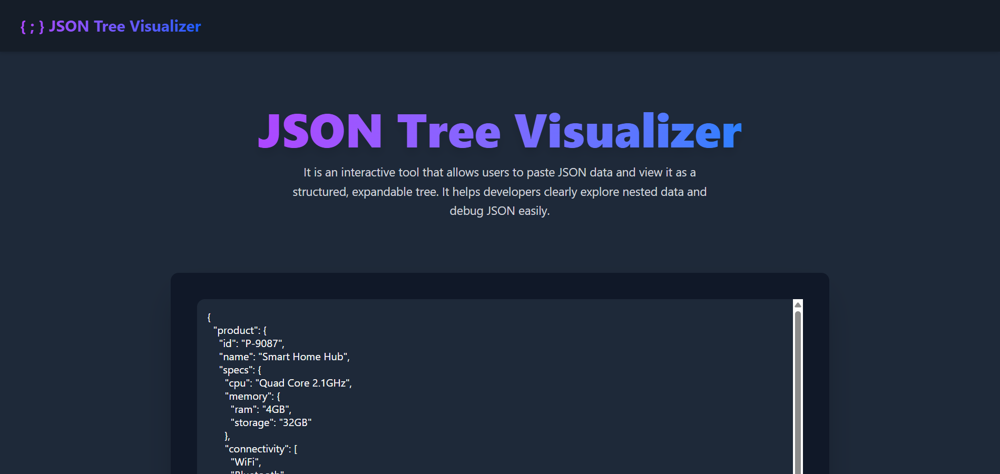
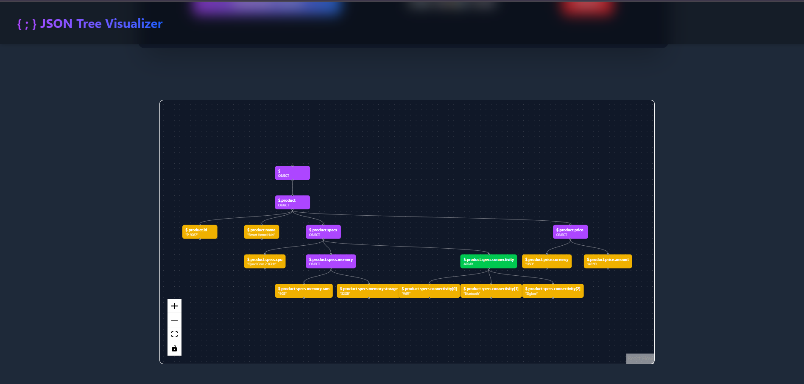

# JSON Tree Visualizer

An interactive web-based tool to visualize JSON data as a hierarchical tree structure. This project helps developers understand, debug, and document complex JSON by representing it in an expandable and collapsible visual graph.

---

## ✨ Features

| Feature | Description |
|--------|-------------|
| **JSON Input** | Paste or type any valid JSON into the input box. |
| **Load JSON Button** | Parses the JSON and generates a tree diagram automatically. |
| **Interactive Tree View** | Displays JSON in a structured node-based visualization using React Flow. |
| **Node Highlighting** | Hovering on a node visually highlights it for better traceability. |
| **Reset Button** | Clears the view and input field to start fresh. |

---

## 🛠️ Tech Stack

| Layer | Technology |
|------|------------|
| Frontend | **React**, **Vite**  |
| Visualization | **React Flow** |
| Styling | Tailwind CSS |

---

## 🚀 Live Demo
https://json-tree-visualizer-liard.vercel.app/

---

## Get Started
- Clone the repository
- And In Terminal, npm run dev

---

## Screenshots

